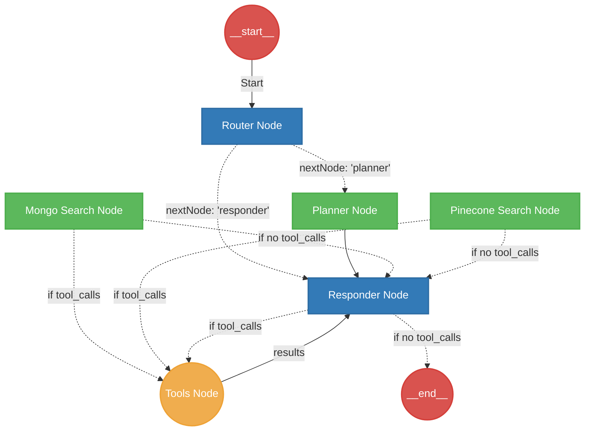

# DeepAgent Architecture Documentation

This document provides a comprehensive overview of the `DeepAgent` architecture, state management, and workflow routing within the LangGraph-based system.

## Graph Visualization

The DeepAgent utilizes a StateGraph architecture powered by LangGraph, where each node represents a specific capability or subagent, and edges define the workflow and tool invocation logic.

> [!NOTE]
> The Router node makes initial routing decisions based on the user query. Data retrieval operations typically route to the Responder, which has all tools bound (both Mongo and Pinecone) to intelligently span queries across multiple collections.

## Core Nodes

### 🔀 Router Node (`routerNode`)
**Purpose**: Analyzes the incoming user message and decides the immediate next step.
- **Logic**: If the query involves planning (e.g., "plan", "steps"), it routes to the `planner`. For data or general inquiries, it routes to the `responder`.

### 📋 Planner Node (`plannerNode`)
**Purpose**: Creates actionable plans based on user requests.
- **Tools**: None directly.
- **Behavior**: Extracts a plan from the user query using the planner prompt and updates the agent's state with `plan` metadata. It subsequently routes to the `responder`.

### 💬 Responder Node (`responderNode`)
**Purpose**: Synthesizes final responses and orchestrates cross-collection data fetching.
- **Tools**: Has access to all tools (`planningTool`, `searchTool`, `apiTool`, `mongoSearchTool`).
- **Behavior**: Uses dynamic schemas, subagent contexts, and user profiles to generate a response. If it calls a tool, the graph loops through the `tools_node` and back to the responder for synthesis.

### 🔍 Mongo Search Node (`mongoSearchNode`)
**Purpose**: Dedicated subagent for MongoDB operational database queries.
- **Tools**: Limited strictly to `mongoSearchTool`.
- **Behavior**: Formulates MongoDB queries for operational data using dynamic schemas. Handles date fields natively using `$gte` / `$lte`.

### 🌲 Pinecone Search Node (`pineconeSearchNode`)
**Purpose**: Dedicated subagent for semantic vector searches.
- **Tools**: Limited strictly to `searchTool` (Pinecone).
- **Behavior**: Focuses on semantic searching within "projects" and "updates" indexes.

## State Management (`DeepAgentState`)

The graph uses an annotated state object to persist memory across steps:

- **`messages`**: Core chat history (LangChain `BaseMessage` arrays).
- **`plan`**: Array of plan steps (`id`, `description`, `status`).
- **`currentStep`**: Tracks the active planning step index.
- **`subAgentResults`**: Dictionary aggregating results and context from subagents.
- **`toolCalls`**: Array tracking dispatched tool calls.
- **`metadata`**: General key-value store (e.g., authenticated user data).
- **`nextNode`**: The immediate target for dynamic routing edges.

> [!TIP]
> **Checkpointer**: The entire graph state is persisted using `MemorySaver`, allowing the agent to remember context over long, multi-turn interactions.
